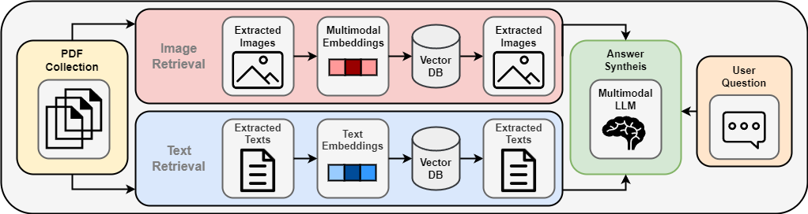
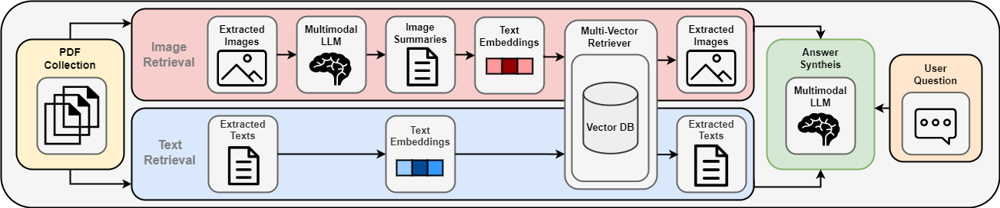

# Scientific Multi-Modal RAG: Optimizing multi-modal RAG with Enhanced Captions for Figures

This repository is based on the official repository of the paper [Beyond Text: Optimizing RAG with Multimodal Inputs for Industrial Applications](https://arxiv.org/abs/2410.21943). 

## Table of Contents

- [Features](#features)
- [Pipeline Overview](#pipeline-overview)
- [Directory Structure](#directory-structure)
- [Usage](#usage)
- [Original Repo Reference](#og-repo-reference)


## Main Features

- **Enhanced Figure Captioning**: Based on existing textual contexts, generate detailed and retrieval-optimized figure captions.
- **Multimodal RAG**: Combines text and image modalities, allowing the model to generate responses using both textual and visual information. Alternatively, text-only and image-only are also options.
- **Evaluation with traditional metrics**: Calculate MRR, recall@k for retrieval as well as BLEU and ROUGE scores for answer generation.
- **Evaluation with LLM as a Judge**: Uses an LLM-based evaluation framework to assess generated responses across multiple metrics such as:
  - **Answer Correctness**
  - **Answer Relevancy**
  - **Text Context Relevancy**
  - **Image Context Relevancy**
  - **Text Faithfulness**
  - **Image Faithfulness**

Answer generation and evaluation are performed using **GPT-4o** or **LLaVA**.


## Pipeline Overview

The **Multimodal RAG** architecture consists of two primary configurations for processing text and image data: 

1. **Multimodal Embeddings and Direct Embeddings**: In this configuration, images are embedded using CLIP, while text is embedded using a different model.

   

2. **Image Summaries and Textual Embeddings**: In this configuration, figure captions are replacing into textual captions using a multimodal LLM. These summaries are then embedded, along with the text chunks extracted from the documents, using the same embedding model (`text-embedding-3-small`). All the embeddings are stored in a single combined vector store, allowing for a unified similarity search that retrieves both text and image information.

   


## Directory Structure

- `dataset`: Dataset for scientific multi-modal RAG (Computer Science domain)
- `src`: Source code for the RAG pipelines:
  - `question_answering`:
    - `rag`: Implements different RAG versions (text-only, image-only, multimodal).
    - `baseline`: Contains baseline methods for comparison with the RAG approaches.
    - `correct_context_prompting`: Implements methods for prompting model with the gold standard context instead of performing RAG as an upper performance bound.
  - `evaluation`: Implements evaluation scripts to judge RAG performance using LLMs.
- `captioning`: Code for generating and evaluating figure captions.
- `dataset_generation`: Code used for generating the benchmark dataset.

## Usage

To use the system, follow these steps:

0.**Install Dependencies**:  
   Use the `requirements.txt` file and set up the correct environment.

1. **Define Models and Paths**:  
   Have a look at the `rag_env.py` file and define your desired models and paths.

2. **Caption Figure Images**:
   
   Use the `caption_figures_with_contexts.py` file to generate enhanced captions for figures using textual context and save into the correct data structure. This requires access to the figure images and necessary textual context.
   
3. **Run the Desired RAG Experiment**:  
   See the `question_answering` folder and choose the appropriate script. Same for Evaluation see `evaluation`.


## Original repository reference:

```bibtex
@misc{riedler2024textoptimizingragmultimodal,
      title={Beyond Text: Optimizing RAG with Multimodal Inputs for Industrial Applications}, 
      author={Monica Riedler and Stefan Langer},
      year={2024},
      eprint={2410.21943},
      archivePrefix={arXiv},
      primaryClass={cs.CL},
      url={https://arxiv.org/abs/2410.21943}, 
}
```